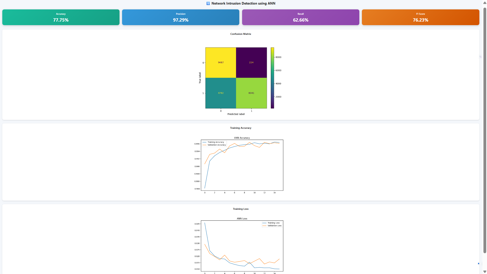
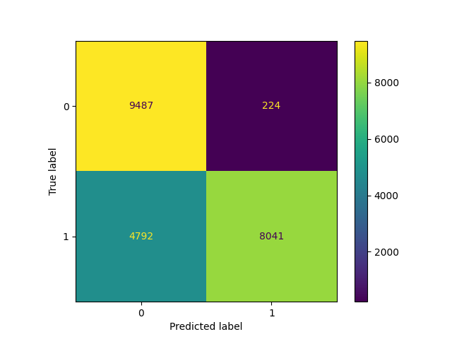
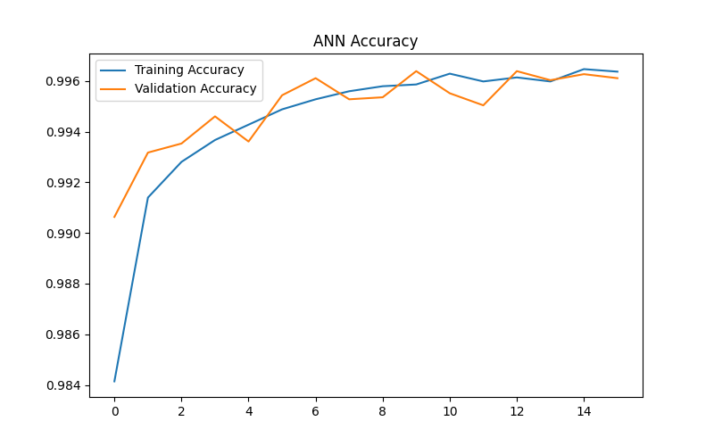
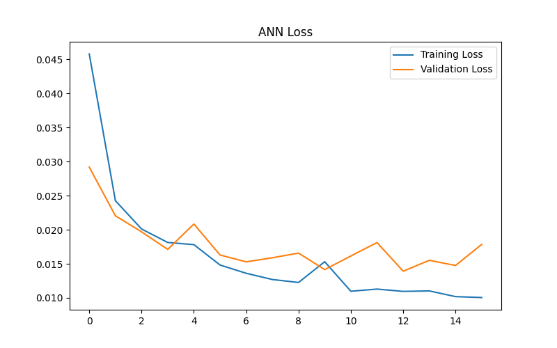

# 🚨 Network Intrusion Detection using Artificial Neural Networks (ANN)

## 📌 Overview

This project implements a **Network Intrusion Detection System (NIDS)** using an **Artificial Neural Network (ANN)** trained on the **NSL-KDD dataset**. The system analyzes network traffic patterns and classifies connections as either normal or malicious, helping identify potential cyber attacks.

A Flask-based web dashboard is included to visualize model performance metrics, training results, and intrusion detection evaluation graphs.

---

## 🎯 Objectives

* Detect malicious network activity using Machine Learning.
* Build an ANN model for binary intrusion classification.
* Preprocess and transform raw network traffic data.
* Evaluate model performance using industry-standard metrics.
* Visualize results through an interactive Flask dashboard.

---

## 🛠 Technologies Used

* Python
* TensorFlow / Keras
* Scikit-Learn
* Pandas
* NumPy
* Matplotlib
* Flask
* NSL-KDD Dataset

---

## 📂 Project Structure

```text
network-intrusion-detection-ann/

├── app.py
│
├── src/
│   └── preprocess.py
│
├── models/
│   └── ann_model.keras
│
├── templates/
│   └── index.html
│
├── static/
│   ├── confusion_matrix.png
│   ├── training_accuracy.png
│   └── training_loss.png
│
├── results/
│   └── metrics.txt
│
├── train.py
├── evaluate.py
├── requirements.txt
└── README.md
```

---

## 📊 Features

### Data Preprocessing

* Data cleaning
* Feature encoding
* Feature scaling
* Dataset preparation for ANN training

### Artificial Neural Network

* Dense Neural Network architecture
* Binary classification
* Model training and validation

### Performance Evaluation

* Accuracy
* Precision
* Recall
* F1 Score
* Confusion Matrix

### Flask Dashboard

* Dynamic metric visualization
* Performance monitoring
* Training accuracy graph
* Training loss graph
* Confusion matrix visualization

---

## 🧠 ANN Architecture

```text
Input Layer
      ↓
Dense Layer (ReLU)
      ↓
Dense Layer (ReLU)
      ↓
Output Layer (Sigmoid)
```

---

## 📈 Evaluation Metrics

The model is evaluated using:

* Accuracy
* Precision
* Recall
* F1 Score
* Confusion Matrix

Performance metrics are automatically loaded into the Flask dashboard from the evaluation pipeline.

---

## 🚀 Running the Project

### Clone Repository

```bash
git clone https://github.com/sonadarshan99/network-intrusion-detection-ann.git

cd network-intrusion-detection-ann
```

### Create Virtual Environment

```bash
python -m venv venv
```

### Activate Virtual Environment

Windows:

```bash
venv\Scripts\activate
```

### Install Dependencies

```bash
pip install -r requirements.txt
```

---

## 🏋️ Train the Model

```bash
python train.py
```

The trained ANN model will be saved in:

```text
models/ann_model.keras
```

---

## 📊 Evaluate the Model

```bash
python evaluate.py
```

This generates:

* Metrics file
* Confusion Matrix
* Training Accuracy Graph
* Training Loss Graph

---

## 🌐 Launch Flask Dashboard

```bash
python app.py
```

Open:

```text
http://127.0.0.1:5000
```

---

## 📷 Dashboard Screenshots

### Dashboard



### Confusion Matrix



### Training Accuracy



### Training Loss



---

## 🔒 Cybersecurity Applications

This project can be applied in:

* Enterprise Network Monitoring
* Security Operations Centers (SOC)
* Threat Detection Systems
* Network Traffic Analysis
* Intrusion Detection Research

---

## 📚 Dataset

**NSL-KDD Dataset**

The NSL-KDD dataset is an improved version of the KDD Cup 1999 dataset and is widely used for intrusion detection research and machine learning experimentation.

---

## 🔮 Future Enhancements

* Multi-class attack classification
* Real-time traffic monitoring
* Deep Learning architectures (CNN/LSTM)
* Explainable AI integration
* Cloud deployment
* Live packet analysis

---

## 👨‍💻 Author

**Sona Darshan**

B.Tech Computer Science & Engineering

GitHub: https://github.com/sonadarshan99

---

## ⭐ If you found this project useful

Please consider giving the repository a star.

